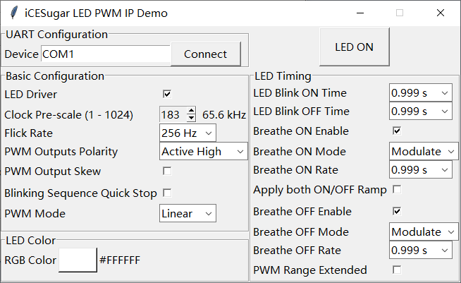

# LED PWM IP Demo

LED PWM IP Demo for [iCESugar](https://github.com/wuxx/icesugar) (using iCE40UP5K)

## Introduction

This demo use iCELink (embedded in iCESugar) to send commands, then to control RGB PWM IP. RGB PWM hard IP is embedded in iCE40 UltraPlus. You can refer to [iCE40 LED Driver Usage Guide](http://www.latticesemi.com/view_document?document_id=50668) for more information.

Every command contains two bytes, the first one is address, and the second one is data. The baudrate is 115200.

When address is in a range of 0x00 - 0x0F, this command will be sent directly to LED PWM IP via *LEDDADDR/LEDDDAT* interface. When command received, *LEDDCS* and *LEDDDEN* will shortly set in one cycle and write to IP.

When address is in a range of 0x10 - 0xFF, this command will be used to modify *LEDDEXE*. When data is 0, *LEDDEXE* will be cleared, otherwise *LEDDEXE* will be set.

For this demo, signal list is below.

| Signal | Direction | Pin Number | Description |
|:-|:-:|:-:|:--|
| clk_12m | input | 35 | clock derived from iCELink (MCO) |
| rxd | input | 4 | received data from iCELink |
| pwm\[0:2\] | output | \[18:21\] | PWM signals, could be used to analysis |
| rgb\[0:2\] | output | \[39:41\] | RGB LED (dedicated pins) |

## Generate synthesizable code

Use SpinalHDL to generate Verilog file. Make sure sbt is installed.

``` bash
sbt run
```

After synthesis, *LedPwmDemo.v* is generated.

You can modify *LedPwmDemo.scala* to adjust current sinks for LED.

## Synthesis, P&R, and generate bitstream

Use *LedPwmDemo.v*, *top.v* and *top.pcf* to generate bitstream.

*LED_PWM_IP_Demo.bin* is generated by iCEcube2. icestorm could be used to generate bitstream, I suppose.

For iCESugar, the generated bitstream can be copied to iCELink. Make sure J3 is in 'Prog Flash' state.

## Demo Application



*led_test.py* can be used to test LED PWM IP. Following is required:

```
Python 3
PySerial
Tkinter
```

To run this demo, enter device path to device (`COMx` for Windows, or `/dev/ttyX` for \*nix), connect to iCELink, and click *LED ON*.

To adjust parameters, please refer to [iCE40 LED Driver Usage Guide](http://www.latticesemi.com/view_document?document_id=50668) for more information.
